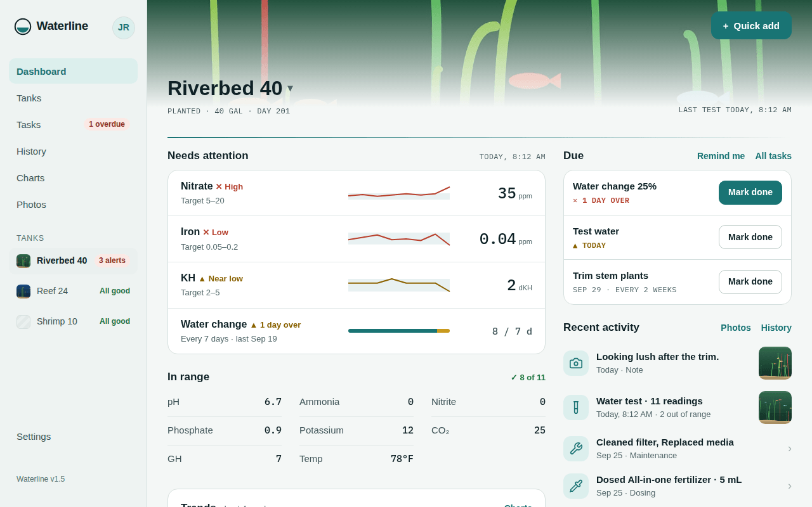
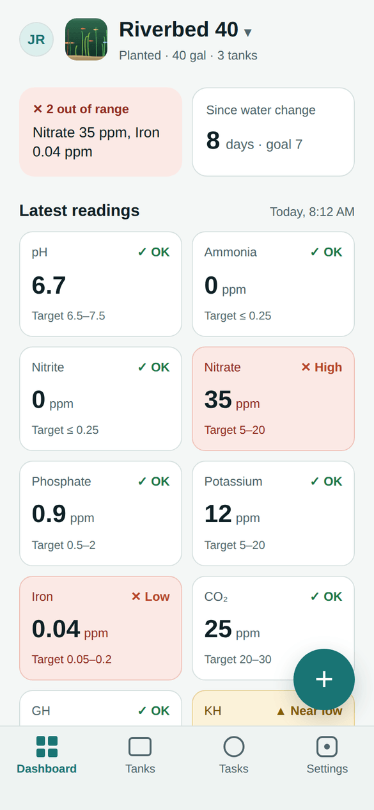
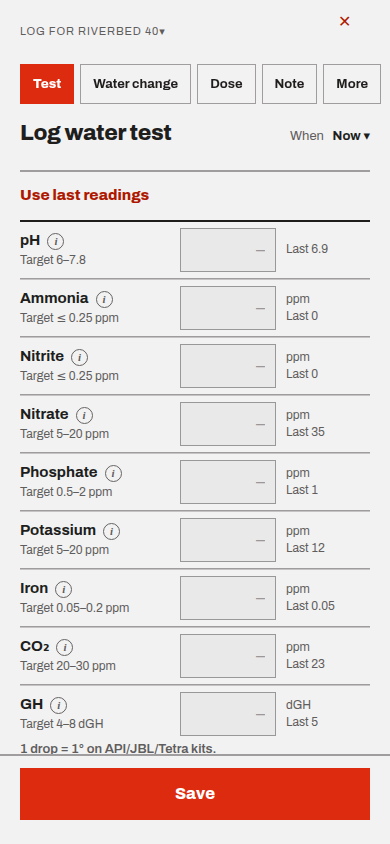
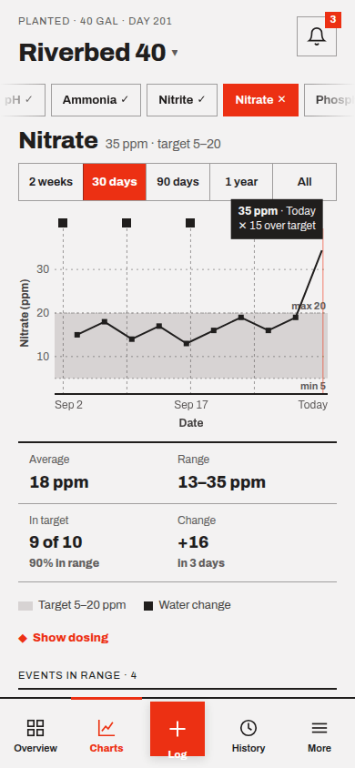

<h1 align="center">
  <picture>
    <source media="(prefers-color-scheme: dark)" srcset="docs/logo-dark.svg">
    
  </picture>
</h1>

<p align="center">
  A self-hosted, phone-first log for your aquariums.<br>
  Log water tests at the tank, see trends on charts, and get reminded when maintenance is due.
</p>

<p align="center">
  <a href="https://github.com/Fiala06/waterline/actions/workflows/ci.yml"></a>
  <a href="https://github.com/Fiala06/waterline/releases"></a>
</p>

<picture>
  <source media="(prefers-color-scheme: dark)" srcset="docs/screenshots/desktop-dashboard-dark.png">
  
</picture>

<p align="center">
  <picture>
    <source media="(prefers-color-scheme: dark)" srcset="docs/screenshots/phone-dashboard-dark.png">
    
  </picture>
  <picture>
    <source media="(prefers-color-scheme: dark)" srcset="docs/screenshots/phone-log-test-dark.png">
    
  </picture>
  <picture>
    <source media="(prefers-color-scheme: dark)" srcset="docs/screenshots/phone-charts-dark.png">
    
  </picture>
</p>

Each server is yours: people sign in with Google (or the local admin login) and see only their own tanks. It works in any browser and installs as an app on phones, with offline logging that syncs later. What's changed, release by release, is in [`CHANGELOG.md`](CHANGELOG.md); ideas and planned work are [GitHub issues](https://github.com/Fiala06/waterline/issues).

## What it does

- **Log at the tank:** water tests with each reading's status as you type (`✓ OK`, `▲ Near`, `✕ High`), water changes, dosing, maintenance, livestock and equipment changes, observations, notes and photos. Every field is optional, times can be backdated, *Use last readings* fills in the previous test, and entries made offline sync later.
- **See how it's going:** a dashboard per tank with the latest readings, days since the water change and what's due; charts with water changes and doses marked, and the same parameter in your other tanks; notes when a reading keeps rising, is heading past its target, drifts between water changes or changes after a dose; History and Photos.
- **Tasks and email:** recurring or one-off tasks, from completion or on a fixed schedule, with snooze. Reminders, overdue and out-of-range alerts by email, one at a time or as a daily or weekly digest, with *Mark done* and *Snooze* right in the email.
- **What's in the tank:** livestock (with a built-in species list, and names and photos for pets), plants and equipment, and what each tank costs, with receipts.
- **Parameters your way:** presets for freshwater, planted, brackish and reef tanks, your own targets and custom parameters, imperial or metric, and hardness in dGH or ppm.
- **Share it, if you like:** an opt-in public page per tank, with share images and search settings, and share links for single photos. Private notes, tasks and exact times are never public.
- **Your data:** a full backup (ZIP with photos) or a CSV of water tests, imports from spreadsheets (undone in one step), a summary to paste into an AI assistant, or [read-only access for one](#ai-assistants-mcp) over MCP.
- **Easy to run:** one Docker container and one data folder. The admin sets up sign-in, email (Mailgun or any SMTP server) and public pages in the app, with logs for troubleshooting and a note when a new version is out.

The design it was built from is in [`design_handoff_waterline/`](design_handoff_waterline/README.md).

## Run it locally

Needs Node 22.

```bash
npm install
cp .env.example .env   # set AUTH_DEV_LOGIN=true to try it without Google
npm run dev
```

Open http://localhost:5173. With `AUTH_DEV_LOGIN=true` the sign-in page shows a test form in place of Google, so you can try the app without OAuth keys. Never turn that on for a real server. Without it, the first page asks for a setup code, as on a real server (see [First start](#first-start)).

### Demo data

With the dev server running (and `AUTH_DEV_LOGIN=true`):

```bash
npm run seed
```

Then sign in with the test form as **demo@example.com**. You get four tanks (planted, reef, a shrimp tank and an archived one) with six months of tests, water changes, dosing, maintenance, photos, livestock, plants, equipment, tasks in every state, a published public page at `/t/riverbed-40-demo`, and a photo share link. Running it again replaces the demo account; your other accounts aren't touched.

## Deploy with Docker

```bash
docker compose up -d
```

Set `ORIGIN` in [`docker-compose.yml`](docker-compose.yml) first; it's the only setting the server needs to start. Everything the app stores (the SQLite database, photos, receipts, and the keys it makes for itself) lives in the `/data` volume.

### First start

1. Open your `ORIGIN` address. A new server asks for a **setup code** first: it's in the container's log (`docker compose logs waterline`, or on Unraid **Docker › Waterline › Logs**) and in `setup-code.txt` in the data folder. Only someone who can see the server has it, so a new server can't be claimed by whoever reaches it first.
2. Choose the admin's username and password. That's the local admin login, and you're signed in with it.
3. In **Settings › Server settings**, set up the rest: Google sign-in (paste the OAuth client's ID and secret; the page shows the redirect URI to give Google), the admin's Google account, who else can sign in, and email delivery.

GitHub Actions also publishes ready-built images (linux/amd64), so you don't have to build on the server. An image is only published once the checks and tests pass:

| Image | Built from |
|---|---|
| `ghcr.io/fiala06/waterline:latest` | every push to `main` (also tagged `:main`) |
| `ghcr.io/fiala06/waterline:1.4.0` | each release, for staying on a version; `:1.4` is the newest 1.4.x |
| `ghcr.io/fiala06/waterline:dev` | every push to `dev` |
| `ghcr.io/fiala06/waterline:sha-xxxxxxx` | every build, for pinning or rolling back |

**HTTPS or plain HTTP.** With an HTTPS name (`ORIGIN=https://tanks.example.com` behind a reverse proxy) everything works, including Google sign-in, offline logging and the install prompt. The name can be LAN-only (local DNS plus a DNS-challenge certificate); email links and public pages then only work on your network.

To keep it on your network without a domain, set `ORIGIN` to the plain address, e.g. `http://192.168.1.50:3000`, and sign in with the local admin login you create on first start. Google won't accept a plain-HTTP address, and browsers turn off offline logging and the install prompt; everything else works.

Everything else is set in the app. These are the environment variables left, for the few things the server needs before it starts, or that you may want outside the app:

| Variable | Needed | What it does |
|---|---|---|
| `ORIGIN` | yes | Public URL people open, e.g. `https://tanks.example.com`. Links in emails (Mark done, Snooze, unsubscribe) and public pages use it too |
| `ADDRESS_HEADER` / `XFF_DEPTH` | behind a proxy | e.g. `X-Forwarded-For` and `1`, so failed logins are limited per visitor rather than for everyone at once |
| `DATA_DIR` | optional | Defaults to `/data` in Docker, `./data` locally |
| `BODY_SIZE_LIMIT` | optional | Largest upload. The Docker image sets `64M` so photos fit; outside Docker set it yourself, since Node defaults to 512K |
| `AUTH_SECRET` / `ENCRYPTION_KEY` | optional | Keys for sign-in sessions and for the stored email and Google passwords. The server makes its own in `/data/keys.json` (readable only by it); set these to keep them outside the data folder. If you set them before, keep them: changing them signs everyone out, and saved passwords need entering again |
| `LOCAL_ADMIN_PASSWORD_HASH` | optional | A way back in if the admin password is lost: create one with `hash-password` in the container's console (or `npm run hash-password`); it opens the local admin login alongside the password set in the app |
| `UPDATE_CHECK_URL` | optional | Where the check for new versions looks, e.g. a fork's `https://raw.githubusercontent.com/<you>/waterline/main/CHANGELOG.md` |

Servers set up before these settings moved into the app keep working: `AUTH_GOOGLE_ID`, `AUTH_GOOGLE_SECRET`, `ADMIN_EMAIL`, `ALLOWED_EMAILS`, `OPEN_SIGNUP` and `LOCAL_ADMIN_USERNAME` apply until the same setting is saved in Server settings, and `EMAIL_SCHEDULER=off` and `UPDATE_CHECK=off` still turn those off.

### Unraid

1. In the Unraid terminal, create the data folder. The container runs as uid 1000, so it needs to own it:

   ```bash
   mkdir -p /mnt/cache/appdata/waterline/data && chown 1000:1000 /mnt/cache/appdata/waterline/data
   ```

   Use your pool's path (`/mnt/cache/...`) rather than `/mnt/user/...`: SQLite's WAL mode doesn't get along with Unraid's FUSE share layer.

2. **Docker › Add Container**:
   - Repository: `ghcr.io/fiala06/waterline:latest` (or `:dev`)
   - Port: container `3000` → any free host port
   - Path: container `/data` → `/mnt/cache/appdata/waterline/data`
   - Variable: `ORIGIN`. Behind a reverse proxy, also `ADDRESS_HEADER=X-Forwarded-For` and `XFF_DEPTH=1`. Everything else is set in the app on first start.
   - WebUI (under *Show more settings*): your `ORIGIN` URL. On plain HTTP, `http://[IP]:[PORT:3000]/` follows IP and port changes, but `ORIGIN` must still match the address you open.

3. With HTTPS, point your reverse proxy (Nginx Proxy Manager, SWAG, Cloudflare Tunnel…) at `http://<unraid-ip>:<host port>`. Either way, open the `ORIGIN` URL and always use that one: any other address loads, but saving fails the cross-site check.

**Updates:** each push to `main` (or `dev`) publishes a new image, and Unraid's Docker tab shows *update ready* for the container. Applying it keeps everything in `/data`; database migrations run on start. When a new version is on `main`, admins also see *Update to 1.5 available* under Settings in the app's menu; after updating, everyone gets the release's highlights once on the dashboard, and the full list is in **Settings › What's new**.

To run `latest` and `dev` side by side, create two containers with different names, host ports, data folders and `ORIGIN` values. Never point two containers at the same data folder.

### Troubleshooting

**Settings › Server settings › Logs** shows what went wrong: emails that didn't send, imports that couldn't be read, sign-in problems, and pages that failed, each with the reference its error page showed. Choose *What the server does too* to also see sign-ins, emails sent, imports and changes to settings, or *Everything, for 24 hours* while you track something down. **Download** gives a text file to share when asking for help, with email addresses shortened. Entries are kept for 30 days, and the container's log (`docker compose logs waterline`) has the same lines.

### AI assistants (MCP)

Each person can let an AI assistant, like Claude or ChatGPT, read their tanks, and picks which ones. It's off until they connect one, and each connection can be disconnected in **Settings › AI assistant** at any time. Assistants can read readings, History, livestock, plants, trends and photos, and can't change anything. Waterline stores no AI keys and calls no AI service: the assistant asks.

- **By signing in (OAuth):** in claude.ai, ChatGPT or another app with custom connectors, add a connector with the address `<ORIGIN>/mcp`. The app registers itself, sends you to Waterline to sign in and pick the tanks, and renews its access on its own (access tokens last an hour, refresh tokens 60 days of use). Waterline follows the MCP authorization spec: `/.well-known/oauth-protected-resource`, `/.well-known/oauth-authorization-server`, dynamic client registration at `/oauth/register`, and PKCE (S256) always.
- **With a token:** for Claude Code, Claude Desktop and scripts, make an access token in Settings › AI assistant. For Claude Code: `claude mcp add --transport http waterline <ORIGIN>/mcp --header "Authorization: Bearer <token>"`. The settings page shows this, and a Claude Desktop config, filled in.
- **JSON API:** the same data as JSON: `GET <ORIGIN>/api/v1/tanks`, then `/api/v1/tanks/<id>/summary` (Markdown), `readings`, `history`, `livestock`, `trends`, `photos`, and `/api/v1/photos/<id>?size=small|large`.
- The assistant has to reach your server, so one running in the cloud (claude.ai, ChatGPT) needs Waterline on a public HTTPS address.

### Security notes

- A new server can only be set up with the setup code from its log, and sign-in is closed by default: only the admin, the people or domains the admin lists, or everyone with a Google account if the admin chooses that.
- The local admin login and the setup code allow 5 failed tries per address every 15 minutes.
- The Google client secret and email passwords are stored encrypted, never sent back to the browser.
- The profile photo in the account menu is copied from Google at each Google sign-in into `/data/avatars` and shown only to its owner, so browsers never load it from Google. A photo someone uploads in Settings › Profile is kept there too, resized to 192px without its metadata (location included), and Google sign-ins don't replace it.
- `AUTH_DEV_LOGIN=true` is for tests only. The server refuses to start with it when `NODE_ENV=production` (as in the Docker image).
- Every response sends `X-Frame-Options: DENY`, `X-Content-Type-Options: nosniff` and `Referrer-Policy: same-origin`, plus HSTS when `ORIGIN` is https. Only this site may post forms to it.
- Signing out clears the app's cached pages and photos on that device (browsers that support `Clear-Site-Data`).
- AI assistant access reads only the tanks it was given, never writes, and is refused once disconnected. Tokens and sign-in codes are stored hashed. `/mcp` and `/api/v1` accept only a token, never the session cookie, and refuse requests from other sites' pages. An app connecting by signing in is sent back only to an address it registered (https, or http on the same computer), must use PKCE, and each sign-in code works once, for 10 minutes; registration allows 20 apps an hour per address.

## Tests

```bash
npm run check      # types + Svelte
npm test           # unit tests: units, status, trends, time zones, imports, money, email, MCP and more
npm run test:e2e   # Playwright, on a phone and a desktop viewport: the core flow and each feature
```

The first time, install the Playwright browser with `npx playwright install chromium`. The core flow (`e2e/core-flow.test.ts`) is sign in → setup → create tank → log test → dashboard → complete task. `AUDIT=1 npx playwright test e2e/audit.test.ts --project=desktop` also checks every screen, at phone and desktop sizes in both themes, for accessibility problems, small tap targets and overflow, and writes what it finds to `test-results/audit.json`.

## Releases

Each release is a section of [`CHANGELOG.md`](CHANGELOG.md), written for the people who use the app: the app shows it under **Settings › What's new**, and its first lines once on the dashboard after an update. To release, bump `version` in `package.json` and add a `## <version> · <date>` section with a few lines, each starting with its name in bold; a unit test fails if the two don't match. The *update available* note admins see comes from the changelog on `main`.

Changes go to `dev` first, then to `main` through a pull request (`gh pr create --base main --head dev`), which runs the checks and tests before the merge. When `main` reaches a version that hasn't been released yet, the workflow ([`ci.yml`](.github/workflows/ci.yml)) tags that build `v<version>`, publishes `:<version>` and `:<major>.<minor>` images, and makes a [GitHub release](https://github.com/Fiala06/waterline/releases) with the version's changelog section as its notes. Ideas and planned work are [issues](https://github.com/Fiala06/waterline/issues), grouped into a milestone for the next release; a commit that finishes one says `Closes #N`, and the issue closes when it reaches `main`.

## Stack

SvelteKit 2 (Svelte 5, adapter-node) · TypeScript · Drizzle ORM + better-sqlite3 · Auth.js · Nodemailer and the Mailgun HTTP API · sharp (photos) · satori + resvg (share images) · a hand-written service worker (offline) · Vitest + Playwright. Values are stored metric (L, °C, cm, dGH) and converted for display in `src/lib/units.ts`; parameter status rules are in `src/lib/status.ts`. Database migrations are in `drizzle/` (`npm run db:generate` after changing `src/lib/server/db/schema.ts`) and run on start.

## Documentation

| File | What's in it |
|---|---|
| [`CHANGELOG.md`](CHANGELOG.md) | What's new in each release, as the app shows it |
| [`CLAUDE.md`](CLAUDE.md) | Ground rules and conventions for working on the code |
| [`design_handoff_waterline/`](design_handoff_waterline/README.md) | The design: tokens, screens, behavior, and the HTML design files |
| [`DATA_MODEL.md`](design_handoff_waterline/DATA_MODEL.md) | The database tables |
| [`BUILD_PLAN.md`](design_handoff_waterline/BUILD_PLAN.md) | The order the first version was built in |
| [`design-brief.md`](design-brief.md) | The original brief the design answered |
| [`SPECIES_SOURCES.md`](src/lib/server/data/SPECIES_SOURCES.md) | Where the bundled species list comes from, and its license |

## License

The code is under the [MIT License](LICENSE). The bundled species list (`src/lib/server/data/species.json`) is shared under CC BY-SA 4.0, because of its Wikipedia sources; see [`SPECIES_SOURCES.md`](src/lib/server/data/SPECIES_SOURCES.md).
